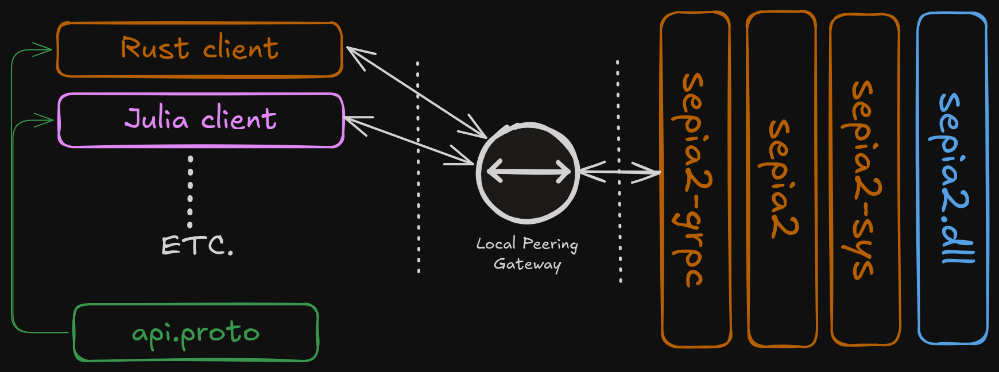

# PicoQuant Sepia2 API Bundle

## Structure

This is composed of three projects
- `sepia2-sys`: C bindgen API with libloading at runtime of the Sepia2 library,
  separating contexts into:
    - [X] `../build`: The build script parses the C headers and generates the
    bindings
    - [X] `api`: function calls that DLL and laser device are controlled with
    - [X] `errors`: error constants for the defined error choices
    - [X] `types`: types of interest for information tracking
    - [X] `constants`: constant defines for flags and lengths defined in the spec
- `sepia2`: High level API in idiomatic Rust
    - [ ] `../build`: Parse `.proto` file and generate API that can be used for both
      stand-alone API or through `gRPC`
      - On the fence to actually go through with this, might be better to keep
      it isolated and have macros from/into that convert, throwing compile time
      error when they don't match
    - [X] `error`: error value casting in enum and conversion to Result
    - [X] `api`: immutable req->resp function calls
    - [X] `constants`: same constants as exposed in `sepia2-sys` that are useful for
      configurations
- `sepia2-grpc`: `Tonic` service instantiating connection to device and control
    - [X] `../build`: Generate service and types from `.proto`
    - [-] `service`: Handle req->resp
    - [ ] `logs`: Configure log subscription channel that dumps logs to both system
        - gRPC Streaming and subscribed channels

## Usage

## Details

For more information check the README for each one of these sub-projects:
- [sepia2-sys](./sepia2-sys)
- [sepia2](./sepia2)
- [sepia2-grpc](./sepia2-grpc)

### Architecture

